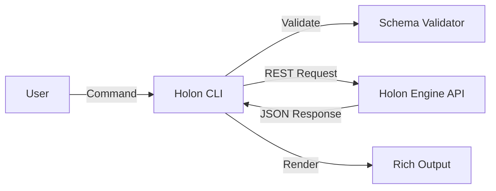

# Holon CLI Technical Specification

## 1. Overview
The Holon CLI is a lightweight, stateless client that interfaces with the Holon Engine. Its primary responsibility is to validate local configuration files (`holon.yaml`) and communicate user intents (deploy, trigger, inspect) to the remote execution plane via REST API.

## 2. Technology Stack
*   **Language:** Python 3.10+
*   **Framework:** [Typer](https://typer.tiangolo.com/) (based on Click) for command parsing.
*   **UI/Formatting:** [Rich](https://github.com/Textualize/rich) for tables, spinners, and colored output.
*   **HTTP Client:** [httpx](https://www.python-httpx.org/) for async/sync API requests.
*   **Validation:** [Pydantic](https://docs.pydantic.dev/) for client-side schema validation before upload.

## 3. Architecture
The CLI follows a "Thin Client" architecture. It does not execute agent logic locally.



### 3.1 Configuration
Global configuration is stored in `~/.holon/config.yaml`.
```yaml
host: "http://localhost:8000"
api_key: "sk_..."
default_project: "my-project"
```

## 4. Core Commands (MVP)

### `holon init`
*   **Goal:** Bootstrap a new project.
*   **Logic:**
    1.  Ask user for project name.
    2.  Generate a `holon.yaml` template.
    3.  Create a `.env.example` file.

### `holon deploy`
*   **Goal:** Register/Update a workflow in the Engine.
*   **Default Behavior:** Looks for `holon.yaml` and `.env` in the current working directory.
*   **Logic:**
    1.  Read `holon.yaml` (from current directory or path specified via `--file`).
    2.  Validate against Pydantic model.
    3.  POST to `/api/v1/deploy`.
    4.  Display deployment ID and status.

### `holon list`
*   **Goal:** Show running processes.
*   **Logic:**
    1.  GET `/api/v1/processes`.
    2.  Render response as a Rich Table (ID, Name, Status, Uptime).

### `holon logs [PROCESS_ID]`
*   **Goal:** View execution history.
*   **Logic:**
    1.  GET `/api/v1/processes/{id}/logs`.
    2.  Stream output to stdout.

### `holon event [PROCESS_ID] [EVENT_NAME]`
*   **Goal:** Manually trigger a workflow step.
*   **Logic:**
    1.  POST `/api/v1/processes/{id}/events`.
    2.  Payload: `{"event": "name", "data": {...}}`.

## 5. Error Handling
*   **Validation Errors:** Caught locally by Pydantic. Printed with clear line numbers pointing to the invalid YAML.
*   **API Errors:** HTTP 4xx/5xx responses are caught and displayed with a red error message using Rich.
*   **Connection Errors:** Friendly message if the Engine is unreachable ("Is the Holon Engine running at http://localhost:8000?").

## 6. Future Scope (Post-MVP)
*   **`holon dev`:** A "watch mode" that hot-reloads the workflow on file save.
*   **`holon secret set`:** Encrypted management of API keys.
*   **TUI:** A full terminal user interface using Textual.
