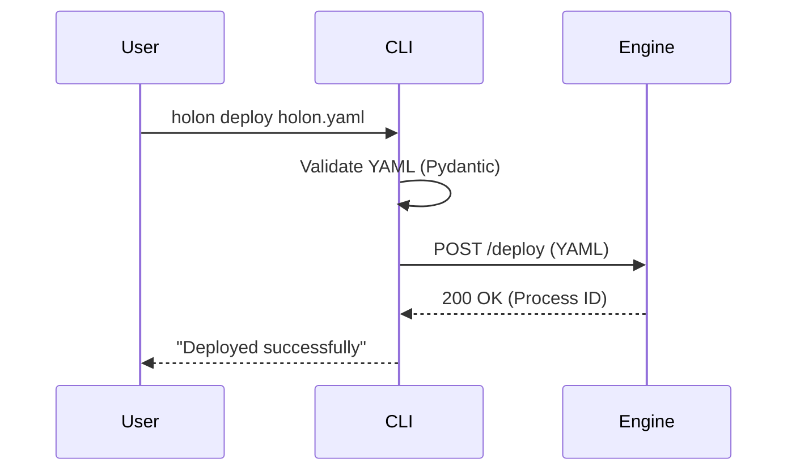
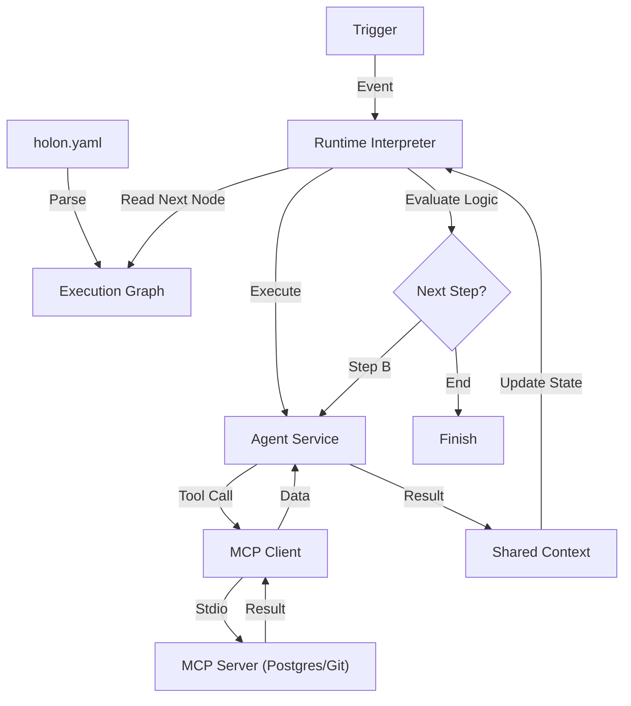
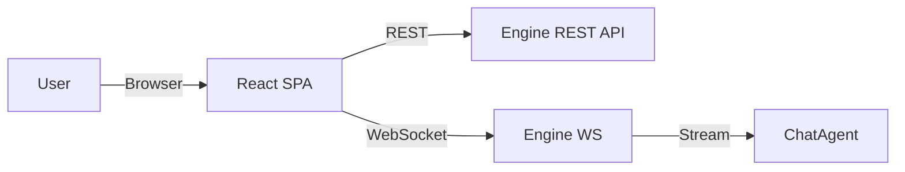

# Holon Design Specification

## 1. Technology Stack

**Decision:** Python (The "AI Native" Stack)

**Reasoning:** Python is chosen for its dominance in the AI ecosystem, allowing native integration with LLM SDKs and data libraries. For the MVP, we prioritize **simplicity and maintainability** over raw async performance.

### 1.1 Core Components

| Component | Technology | Justification |
|-----------|------------|---------------|
| **Language** | **Python 3.10+** | Standard version for AI workloads. |
| **CLI Framework** | **Typer** | Modern, type-safe CLI builder. Excellent developer experience. |
| **API / Backend** | **FastAPI** | High-performance web framework. Native Pydantic integration for schema validation and auto-generated docs. |
| **Configuration** | **Pydantic** | Strict schema validation for `holon.yaml` files. |
| **State Store** | **SQLite** | Simple, file-based persistence for process state and history. |
| **Dashboard UI** | **React + DeepChat** | Standalone SPA for monitoring. Uses DeepChat component for the embedded chat interface. |

---

## 2. Architecture Overview

The system is divided into three primary artifacts:

1.  **Holon CLI (`holon`)**: The client-side tool for developers.
2.  **Holon Engine (Service)**: The server-side execution plane.
3.  **Holon Dashboard (UI)**: A standalone Single Page Application (SPA) for monitoring and visualization.

### 2.1 Execution Model (Synchronous + Threading)

To keep the MVP simple, the core engine will run synchronously.
- **Sequential Steps:** Executed one after another in the main thread.
- **Parallel Steps (Scatter-Gather):** Offloaded to a `ThreadPoolExecutor`. This allows us to wait for multiple slow LLM responses simultaneously without blocking the entire application, but without the complexity of the `async/await` event loop.

### 2.2 Data Flow

1.  **CLI** sends a `holon.yaml` to the **API**.
2.  **API** parses it with **Pydantic** and stores the definition in **SQLite**.
3.  When **Triggered**:
    *   The **Engine** loads the workflow definition.
    *   It iterates through the `steps`.
    *   If a step is `type: agent`, it calls the provider (e.g., OpenAI) via the Python SDK.
    *   If a step is `type: scatter-gather`, it spins up threads for each task.
    *   Results are stored in a shared **Context Dictionary**.
4.  **Final Output** is returned or saved.
---

## 3. Component Details

### 3.1 Holon CLI
*   **Stack:** Python, Typer, Rich (for pretty terminal output).
*   **Role:** The primary interface for developers. It handles local validation of `holon.yaml` files before submission and streams logs from the engine.
*   **Design:** Stateless client. Authenticates via API Key.

### 3.2 Holon Engine
*   **Stack:** Python, FastAPI, SQLite, Pydantic.
*   **Role:** A dynamic runtime interpreter that executes HolonDSL configurations. It acts less like a static job runner and more like a virtual machine for agentic workflows.
*   **Design:**
    *   **DSL Parser:** Ingests `holon.yaml` and compiles it into an execution graph (DAG).
    *   **Runtime Interpreter:** Traverses the graph dynamically. It resolves variables (e.g., `${trigger.input}`) and determines the next step based on logic defined in the YAML.
    *   **Context Manager:** Maintains the shared state (Blackboard) for the duration of the process, allowing data to flow between loosely coupled agents.
    *   **MCP Client:** A built-in client that manages subprocesses for MCP Servers, allowing agents to call external tools (databases, filesystems) via the standard protocol.

### 3.3 Holon Dashboard
*   **Stack:** React, Vite, TailwindCSS, DeepChat.
*   **Role:** Observability and interaction.
*   **Design:**
    *   **Views:** Process List, Trace View (Waterfall graph of steps), Logs.
    *   **Chat:** Embedded `DeepChat` component connecting to the Engine's WebSocket endpoint for "Human-in-the-Loop" or direct agent interaction.

